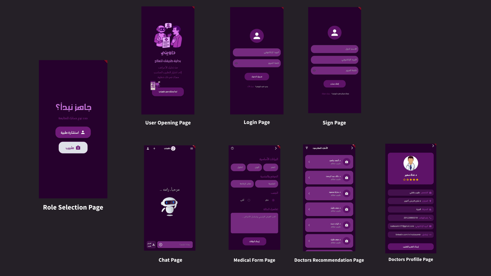
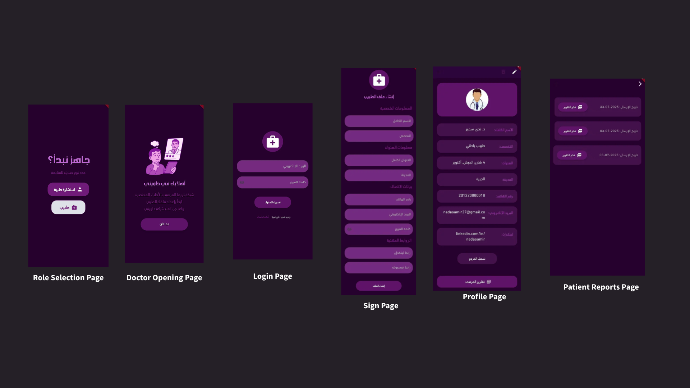

#   Dawini - داويني
## AI-Powered Arabic Healthcare Assistant
**Dawini (داويني)** is an AI-powered **mobile medical assistant application** designed to bridge the gap in accessible healthcare for Arabic speakers. As our graduation project, it delivers a seamless user experience on mobile devices, guiding users from initial symptom understanding to appropriate specialist recommendations, enhancing health literacy and access to care.

Developed with **Flutter** for the robust mobile interface, alongside **Firebase**, **Flask**, and **custom-trained AI models** deployed on **Lightning Studio**.

---

## ✨ The Problem Dawini Solves

Millions of Arabic speakers lack access to reliable, personalized medical guidance in their native language. They struggle with:

* Accurately describing symptoms.
* Navigating overwhelming and often unreliable online health information.
* Identifying the correct medical specialty for their condition.

Dawini addresses these critical gaps by providing an intelligent, culturally relevant digital health companion accessible directly on a mobile device.

---

## 🧠 How Dawini Works (Our AI Core)

Our system leverages two main AI models for a comprehensive approach, integrated within a user-friendly mobile application:

1. **Conversational Symptom Analysis (LLM):**
    * **Purpose:** Allows users to describe symptoms naturally in Arabic via a chatbot interface within the app.
    * **Model:** A fine-tuned **Aya Expanse 8B** (Large Language Model) to ensure context-aware and medically relevant responses. We significantly refined its prompt structure for improved accuracy and tone.

2. **Medical Specialty Classification:**
    * **Purpose:** Based on structured user input collected through the app's forms, accurately predicts the most suitable medical specialty for referral.
    * **Data Foundation:** We extensively preprocessed a large Arabic Healthcare Dataset, carefully merging and balancing categories into **20 distinct medical specialties** for robust classification.
    * **Model:** A robust Hybrid CNN-BiLSTM architecture.

---

## 🌟 Key Features

* **Intuitive Mobile User Interface (Flutter):** Our primary focus was building a **clean, responsive, and easy-to-navigate mobile application** to ensure a seamless user experience.
* **AI-Powered Chatbot:** Natural language symptom description and intelligent responses directly within the app.
* **Intelligent Triage:** Accurately classifies user symptoms into specific medical specialties via structured forms.
* **Personalized Doctor Recommendations:** Filters doctors by predicted specialty and user's GPS location, displayed clearly on the app.
* **Automated Medical Reports:** Generates structured PDF summaries of user cases, securely stored and shareable with doctors through the app.
* **Dual User Roles:** Separate, tailored interfaces for Patients and Doctors, managed through the mobile application.
* **Arabic Language Support:** Designed from the ground up to support and understand Arabic medical dialogue.

---

## 📸 App Screenshots

Explore Dawini's user interface through key screens from both patient and doctor flows:

## 👤 Patient Flow  

## 🩺 Doctor Flow  

---

## 🧰 Tech Stack

| Area                     | Technology                  |
| :----------------------- | :-------------------------- |
| **Mobile App (Frontend)**| Flutter                     |
| **Backend & API**        | Flask, FastAPI              |
| **Authentication**       | Firebase Authentication     |
| **AI Model Deployment**  | Lightning Studio            |
| **Data & Reports Storage** | Firebase Firestore, Cloudinary |

---

## 🚀 See Dawini in Action!

* 📁 **[Download APK, Demo Videos,Single Screenshots, and Final Report](https://drive.google.com/drive/folders/1_ezvSppek6HZfqBCWK9YNfBxw27K2Tk2?usp=sharing)**  
* 🖥️ **[View Our Presentation Slides](https://www.canva.com/design/DAGsMs5m6Tg/EM-IkYdmNXn7eSNStUxxrg/view?utm_content=DAGsMs5m6Tg&utm_campaign=designshare&utm_medium=link2&utm_source=uniquelinks&utlId=hb8f5d41854)**

> **Note on Live AI Demo:**  
> While our AI models were successfully deployed for development and testing on Lightning Studio, public real-time access might be limited by free-tier usage constraints. We are actively working on migrating to a more sustainable hosting solution for continuous availability of the full AI features. The core application logic and user interface are, however, fully functional.

---
## 📂 Project Structure
`dawini/`
👉 [View Full the code files outline](dawini/README.md)

---

## 📌 Project Info

* 📅 Academic Year: 2024–2025
* 🏫 Graduation Project — Artificial Intelligence Department, Cairo University